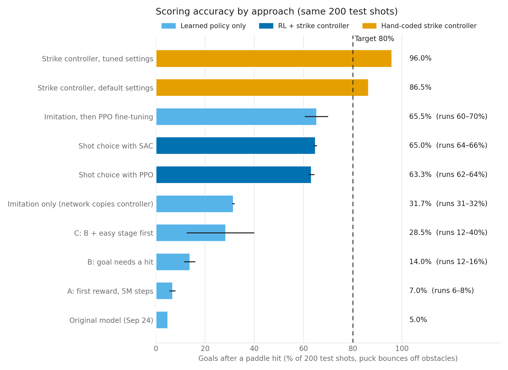

# TACC experiments, September 28 to October 7, 2026

Goal: score on at least 80% of shots with an obstacle on the table. Every number below is measured
on the same 200 test shots (evaluation seed 30000: 10 obstacle layouts x 20 shots), counting only
goals that follow a paddle hit, with the bounce rule (the puck rebounds off obstacles).



| Approach | Goals after a hit / 200 (3 training runs) | Accuracy |
|---|---|---|
| Original model (September 24) | 10 | 5.0% |
| A: original reward, trained 5x longer | 16, 15, 11 | 7.0% |
| B: goal needs a hit, timeout cost 10 | 23, 29, 32 | 14.0% |
| C: B + easy first stage (slow puck, no obstacles) | 66, 80, 25 | 28.5% |
| Imitation only (network copies the strike controller) | 64, 64, 62 | 31.7% |
| Shot choice, PPO (policy aims, controller executes) | 127, 124, 129 | 63.3% |
| Shot choice, SAC | 131, 131, 128 | 65.0% |
| Imitation, then PPO fine-tuning (pure neural policy) | 121, 140, 132 | 65.5% |
| Strike controller, default settings | 173 | 86.5% |
| **Strike controller, tuned settings** | **192** | **96.0%** |

The tuned controller also scored 93% with two obstacles, 89% with three, and 90.5% with pucks
faster than any seen in tuning (1.5-2.0 m/s). These conditions were never used for tuning.

## What was wrong with the original approach

* **Not overfitting.** Success on training episodes matched the test score (for example 8-12% training vs about 10% test for B), so
  the policy was failing to learn the task, not memorizing shots.
* **The reward discouraged shooting.** A goal counted without a paddle hit, and timing out cost about -3
  in total while hitting the obstacle cost -20, so waiting was the safest choice.
* **Learning curves peaked, then degraded.** Version C was best at about 1.5M steps (37% average, 55% best run under
  the bounce rule) and declined to 23% by 5M with a constant learning rate
  ([curves](figures/tacc_2026-10/sweep1_learning_curves_bounce_rules.png)). Training longer did not help;
  version A trained 5x longer with the old reward and stayed at about 5%.
* **The control problem is hard to learn from scratch.** At 20 Hz the policy must time an interception,
  hit the puck at the right point (1 cm of sideways error turns the shot by about 7 degrees), and aim
  around the obstacle, all from a goal signal that arrives 20-40 steps later.

## Changes

| Change | Where |
|---|---|
| Goal must follow a paddle hit; configurable timeout cost (task v3) | `scripts/precision_striker_env.py` (`--require-hit`, `--timeout-penalty`) |
| Puck bounces off obstacles instead of ending the shot (task v4) | `--obstacle-bounce` |
| Observe "already hit" and "time used"; goal-mouth progress reward (task v5) | `--extra-obs`, `--goal-shaping` |
| Goal judged where the puck crosses the end line (v4+). Fast diagonal goals were being missed between 20 Hz samples and recorded as "escaped" | `_crossed_mouth` |
| Every shot is geometrically scorable: a clear straight or one-bank path exists from the incoming puck path. Audit of 12,000 random episodes (1-3 obstacles) found none unscorable; the environment redraws obstacles if one ever is | `scripts/scoring_geometry.py` |
| Strike controller: predicts the puck path (damping, rail bounces), picks an interception point and a clear aim, and solves the paddle-puck collision so the puck leaves along the aim | `scripts/strike_planner.py` |
| PPO settings exposed (learning rate and schedule, entropy, gamma, epochs, minibatch, network width), SAC option | `scripts/train_precision_striker.py` |
| RL on top of the controller: shot choice (`--hybrid shot`), residual corrections (`--hybrid residual`), imitation then PPO | `scripts/hybrid_envs.py`, `scripts/train_bc.py` |
| Learning curves from saved checkpoints | `scripts/tacc/curve_eval.py`, `scripts/analysis/plot_curves.py` |

Settings that reproduce the original experiments are unchanged by default; every new option is opt-in
and recorded in each run's `manifest.json`.

## How the controller was tuned without overfitting the test

`scripts/tacc/planner_search.py`, Lonestar6 job 3494326:

1. 270 setting combinations on validation seed 50000 (median 97%, best 100%).
2. The top 10 on an independent validation seed 60000 (best combined: 100% and 96.5%).
3. Only the winner on the test seed 30000, once: 192/200. It reproduces exactly on a laptop:
   `python -m scripts.eval_planner --tuned --seed 30000`.

Winning settings (`strike_planner.TUNED`): `kp_lat 16, kp_track 8, min_slack 0, out_speed 2.4, tau 0.12`.

## Reproduce

```bash
python -m scripts.eval_planner --tuned --seed 30000            # 96.0% in about 20 s
python -m unittest discover -s tests                           # 14 tests
sbatch -A OTH24028 -p development scripts/tacc/sweep3_all.slurm   # RL strategies on 4 nodes
```

## Still running when this was written (October 7, about 14:30)

* Residual PPO (correction on top of the controller): training success rose from 73% to 93%; final test pending.
* Longer fine-tuning for imitation then PPO (one run was still improving at 4M steps) and residual PPO
  (`scripts/tacc/followup3.slurm`).
* Learning curves for the strategies above (`scripts/tacc/curves3.slurm`) and the earlier E-I sweep.

## Data

`docs/experiment_data/tacc_2026-10/`: comparison table, first-sweep learning curves (both rule sets),
planner search stages 1-3, sweep-3 evaluations with manifests, and the bounce-rule re-scoring of the
first sweep and the original model.
